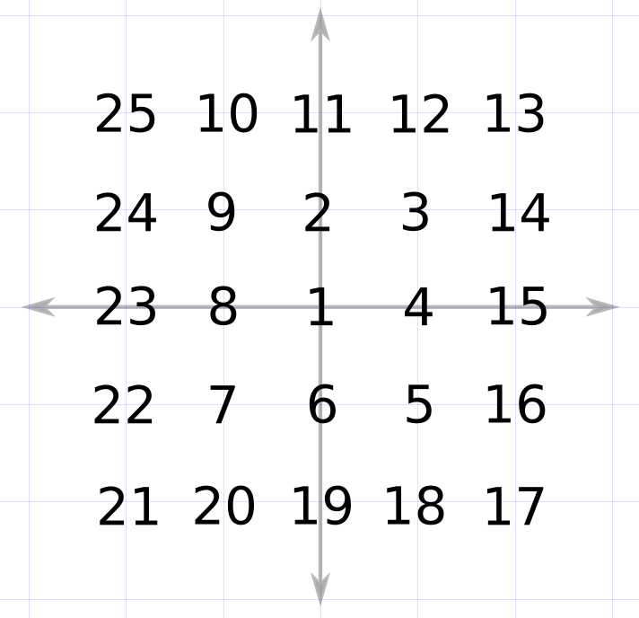

# SpiralSolver

**Solves this type of Puzzle**

Come up with an algorithm (or function) to map each number to its cartesian coordinate. So 1 is (0,0), 14 is (2, 1), etc. 
## Run
`iex -S mix`
`iex>SpiralSolver.run`

Or you can give it an integer and it will solve for that ending integer. As is it defaults to 25

`iex -S mix`
`iex>SpiralSolver.run(100)`